# MSMD-Synthesizer Interactive Diagrams

## 1. Comparison: Traditional Retrieval-Based vs Proposed Generative/Modification-Based Approach

```mermaid
graph TB
    subgraph Traditional["⚙️ Traditional Retrieval-Based Synthesis"]
        T1["📋 Design Requirements"] --> T2["🔍 Database Search<br/>(Keyword/TF-IDF)"]
        T2 --> T3["📚 Retrieve Existing<br/>Complete Solutions"]
        T3 --> T4{"✅ Exact<br/>Match?"}
        T4 -->|Yes| T5["✓ Solution Found"]
        T4 -->|No| T6["❌ No Solution<br/>(Manual Design Needed)"]

        style T1 fill:#e1f5ff
        style T2 fill:#fff4e6
        style T3 fill:#fff4e6
        style T4 fill:#ffe7e7
        style T5 fill:#d4edda
        style T6 fill:#f8d7da
    end

    subgraph Proposed["🚀 Proposed Generative/Modification-Based Approach"]
        P1["📋 Design Requirements<br/>(Elemental Functions)"] --> P2["🤖 AI-Powered Analysis<br/>(Gemini AI)"]
        P2 --> P3["🧩 Select Base<br/>Building Block"]
        P3 --> P4["📊 Initialize<br/>Mechanism Graph"]
        P4 --> P5["🔄 A* Search Engine"]
        P5 --> P6["📝 Apply Transformation<br/>Rules Iteratively"]
        P6 --> P7["✔️ Validate EF<br/>Satisfaction"]
        P7 -->|Not Satisfied| P5
        P7 -->|All EFs Satisfied| P8["✅ Novel Solution<br/>Generated"]
        P6 -.->|R3.1: Add Stopper<br/>R4.1: Add Spring<br/>R2.1: Add Variable Joint| P6

        style P1 fill:#e1f5ff
        style P2 fill:#d4f1f4
        style P3 fill:#d4f1f4
        style P4 fill:#f0e6ff
        style P5 fill:#ffe6f0
        style P6 fill:#fff0cc
        style P7 fill:#ffe6f0
        style P8 fill:#d4edda
    end

    Legend["📊 Key Advantages:<br/>✓ Handles novel requirements<br/>✓ Generates custom solutions<br/>✓ Systematic modification<br/>✓ Context-aware AI"]

    style Traditional fill:#fff0f0,stroke:#cc0000,stroke-width:3px
    style Proposed fill:#f0fff0,stroke:#00cc00,stroke-width:3px
    style Legend fill:#ffffcc,stroke:#666,stroke-width:2px,stroke-dasharray: 5 5
```



---

## 2. High-Level Architecture of the Proposed Framework

```mermaid
graph TB
    subgraph Input["📥 INPUT LAYER"]
        I1["👤 User Requirements<br/>(Natural Language)"]
        I2["📋 Task Specification<br/>(JSON Format)"]
        I3["📑 Elemental Functions<br/>(EF1, EF2, EF3, EF4)"]
        I1 --> I2 --> I3
    end

    subgraph Knowledge["🧠 KNOWLEDGE BASE"]
        K1[("🧩 Building Blocks<br/>Database<br/>(10+ mechanisms)")]
        K2[("📜 Transformation<br/>Rules<br/>(10+ rules)")]
        K3[("🔧 Joint Types<br/>(R, P, X, F)")]
    end

    subgraph AI["🤖 AI INTELLIGENCE LAYER"]
        A1["🌟 Gemini AI<br/>Retrieval Engine"]
        A2["💡 Context-Aware<br/>Ranking"]
        A3["📊 Reasoning<br/>Generation"]
        A1 --> A2 --> A3
    end

    subgraph Core["⚙️ CORE SYNTHESIS ENGINE"]
        C1["🏗️ Initial Solution<br/>Generator"]
        C2["🔍 A* Search<br/>Algorithm"]
        C3["📐 Mechanism Graph<br/>Representation"]
        C4["✔️ EF Validator<br/>Module"]
        C5["🔄 Rule Application<br/>Engine"]

        C1 --> C2
        C2 <--> C3
        C2 --> C5
        C5 --> C4
        C4 -->|Not Satisfied| C2
        C4 -->|Satisfied| C6["✅ Solution"]
    end

    subgraph Analysis["📊 ANALYSIS & VALIDATION"]
        V1["🔢 DOF Calculator<br/>(Grubler's Formula)"]
        V2["🔗 Connectivity<br/>Checker"]
        V3["🎯 EF Type Validator<br/>(1.1, 1.2, 2, 3)"]
    end

    subgraph Output["📤 OUTPUT LAYER"]
        O1["📈 Step-by-Step<br/>Visualization"]
        O2["🖼️ Final Mechanism<br/>Diagram"]
        O3["📝 Synthesis Report<br/>(Rules Applied)"]
        O4["💾 Graph Export<br/>(JSON/HTML)"]
    end

    I3 --> A1
    K1 --> A1
    A3 --> C1
    K2 --> C5
    K3 --> C3

    C3 --> V1
    C3 --> V2
    C4 --> V3

    C6 --> O1
    C6 --> O2
    C6 --> O3
    C6 --> O4

    style Input fill:#e3f2fd,stroke:#1976d2,stroke-width:2px
    style Knowledge fill:#fff3e0,stroke:#f57c00,stroke-width:2px
    style AI fill:#f3e5f5,stroke:#7b1fa2,stroke-width:2px
    style Core fill:#e8f5e9,stroke:#388e3c,stroke-width:3px
    style Analysis fill:#fce4ec,stroke:#c2185b,stroke-width:2px
    style Output fill:#e0f2f1,stroke:#00695c,stroke-width:2px
```



---

## 3. System Architecture: From Natural Language Input to Simulated Mechanism

```mermaid
flowchart TB
    Start["🎯 START"] --> NL["👤 Natural Language Input<br/><i>'Design a door latch with<br/>handle and bolt'</i>"]

    NL --> Parse["📝 Parse Requirements"]
    Parse --> JSON["📋 Generate Task JSON<br/>┌─────────────────┐<br/>│ Task Name       │<br/>│ Elements: E1,E2 │<br/>│ EFs: EF1-EF4    │<br/>└─────────────────┘"]

    JSON --> Gemini["🤖 Gemini AI Analysis"]
    Gemini --> Rank["📊 Rank Building Blocks<br/>1. Slider-Crank (0.95)<br/>2. Rack-Pinion (0.85)<br/>3. Cam-Follower (0.78)"]

    Rank --> Init["🏗️ Create Initial Graphs<br/>┌───┬───┐<br/>│ E1│-R-│E2│<br/>└───┴───┘"]

    Init --> AStar["🔍 A* Search Begins"]

    AStar --> Iter1["📍 Iteration 1:<br/>Base Mechanism"]
    Iter1 --> Check1["✔️ Validate EFs:<br/>✓ EF1 (Type-1.1)<br/>✗ EF2 (Type-2)<br/>✗ EF3 (Type-3)<br/>✗ EF4 (Type-1.2)"]

    Check1 --> Rule1["🔄 Apply Rule R3.1<br/>ADD_STOPPER"]
    Rule1 --> Iter2["📍 Iteration 2:<br/>With Stopper"]
    Iter2 --> Check2["✔️ Validate EFs:<br/>✓ EF1<br/>✓ EF2<br/>✗ EF3<br/>✗ EF4"]

    Check2 --> Rule2["🔄 Apply Rule R4.1<br/>ADD_RETURN_SPRING"]
    Rule2 --> Iter3["📍 Iteration 3:<br/>With Spring"]
    Iter3 --> Check3["✔️ Validate EFs:<br/>✓ EF1<br/>✓ EF2<br/>✓ EF3<br/>✗ EF4"]

    Check3 --> Rule3["🔄 Apply Rule R2.1<br/>ADD_VARIABLE_JOINT"]
    Rule3 --> Iter4["📍 Iteration 4:<br/>Complete Solution"]
    Iter4 --> Check4["✔️ Validate EFs:<br/>✓ EF1 ✓ EF2<br/>✓ EF3 ✓ EF4"]

    Check4 --> Visual["🖼️ Generate Visualization"]
    Visual --> Sim["⚙️ Kinematic Simulation"]
    Sim --> Report["📝 Generate Report:<br/>• Rules Applied: R3.1, R4.1, R2.1<br/>• DOF: 1<br/>• Components: 5"]

    Report --> Final["✅ FINAL OUTPUT:<br/>Simulated Mechanism"]

    subgraph Visualization["📊 Continuous Visualization"]
        V1["💾 Save step_000_initial.png"]
        V2["💾 Save step_001_R3.1.png"]
        V3["💾 Save step_002_R4.1.png"]
        V4["💾 Save step_003_R2.1.png"]
    end

    Iter1 -.-> V1
    Iter2 -.-> V2
    Iter3 -.-> V3
    Iter4 -.-> V4

    style Start fill:#4caf50,color:#fff
    style NL fill:#e1f5ff
    style Gemini fill:#f3e5f5,stroke:#7b1fa2,stroke-width:2px
    style AStar fill:#fff3e0,stroke:#f57c00,stroke-width:2px
    style Check1 fill:#ffebee
    style Check2 fill:#ffebee
    style Check3 fill:#ffebee
    style Check4 fill:#c8e6c9,stroke:#2e7d32,stroke-width:2px
    style Final fill:#4caf50,color:#fff,stroke:#1b5e20,stroke-width:3px
    style Visualization fill:#e0f7fa,stroke:#006064,stroke-width:2px
```



---

## 4. Visualizing Rule Application: Base Mechanism vs Modified Mechanism

```mermaid
graph LR
    subgraph Base["🔷 BASE MECHANISM<br/>(Slider-Crank)"]
        B_Handle["⚫ E1: Handle<br/>(Input)"]
        B_Crank["⚫ Crank"]
        B_Rod["⚫ Connecting Rod"]
        B_Bolt["⚫ E2: Bolt<br/>(Output)"]
        B_Ground["⬛ Ground"]

        B_Handle -->|"R<br/>(Revolute)"| B_Crank
        B_Crank -->|"R"| B_Rod
        B_Rod -->|"P<br/>(Prismatic)"| B_Bolt
        B_Bolt -->|"P"| B_Ground
        B_Ground -->|"F<br/>(Fixed)"| B_Handle
    end

    Transform["🔄 TRANSFORMATION RULES<br/>════════════════<br/>📝 R3.1: ADD_STOPPER<br/>📝 R4.1: ADD_RETURN_SPRING"]

    subgraph Modified["🔶 MODIFIED MECHANISM<br/>(With Stopper & Spring)"]
        M_Handle["⚫ E1: Handle<br/>(Input)"]
        M_Crank["⚫ Crank"]
        M_Rod["⚫ Connecting Rod"]
        M_Bolt["⚫ E2: Bolt<br/>(Output)"]
        M_Ground["⬛ Ground"]
        M_Stopper["🔴 Stopper<br/>(Constraint)<br/><b>NEW - R3.1</b>"]
        M_Spring["🟢 Return Spring<br/>(Force Element)<br/><b>NEW - R4.1</b>"]

        M_Handle -->|"R"| M_Crank
        M_Crank -->|"R"| M_Rod
        M_Rod -->|"P"| M_Bolt
        M_Bolt -->|"P"| M_Ground
        M_Ground -->|"F"| M_Handle

        M_Stopper -.->|"Limits<br/>rotation"| M_Handle
        M_Spring -.->|"Return<br/>force"| M_Bolt
        M_Ground ---|"Fixed to"| M_Stopper
        M_Ground ---|"Anchored"| M_Spring
    end

    Base ==> Transform
    Transform ==> Modified

    Legend["📊 LEGEND<br/>═══════════<br/>⚫ Kinematic Elements<br/>⬛ Ground/Frame<br/>🔴 Stopper (R3.1)<br/>🟢 Spring (R4.1)<br/>━━ Solid Connection<br/>┈┈ Constraint/Force<br/><br/>🎯 Satisfies:<br/>✓ EF2: Constraint (Type-2)<br/>✓ EF3: Return (Type-3)"]

    style Base fill:#e3f2fd,stroke:#1976d2,stroke-width:3px
    style Modified fill:#e8f5e9,stroke:#2e7d32,stroke-width:3px
    style Transform fill:#fff3e0,stroke:#f57c00,stroke-width:2px
    style Legend fill:#f5f5f5,stroke:#666,stroke-width:2px
    style M_Stopper fill:#ffcdd2,stroke:#c62828,stroke-width:3px
    style M_Spring fill:#c8e6c9,stroke:#2e7d32,stroke-width:3px
    style B_Handle fill:#bbdefb
    style B_Bolt fill:#bbdefb
    style M_Handle fill:#c8e6c9
    style M_Bolt fill:#c8e6c9
```



---

## 5. Final Synthesized Mechanism with Color-Coded Components


---

## 📌 Usage Instructions

### For LaTeX Report Integration:

1. **Using Mermaid with LaTeX:**

   - Install `mermaid-cli`: `npm install -g @mermaid-js/mermaid-cli`
   - Convert to PDF/PNG: `mmdc -i diagram.mmd -o diagram.pdf`
   - Include in LaTeX: `\includegraphics{diagram.pdf}`

2. **Alternative - Use Overleaf:**

   - Overleaf supports Mermaid diagrams directly
   - Copy the code between `mermaid ... ` blocks

3. **Or Export as Images:**
   - Use online tools like https://mermaid.live/
   - Copy each diagram code
   - Export as SVG/PNG
   - Include in LaTeX report

### For Interactive HTML:

```html
<!DOCTYPE html>
<html>
  <head>
    <script src="https://cdn.jsdelivr.net/npm/mermaid/dist/mermaid.min.js"></script>
    <script>
      mermaid.initialize({ startOnLoad: true });
    </script>
  </head>
  <body>
    <div class="mermaid">
      <!-- Paste Mermaid code here -->
    </div>
  </body>
</html>
```

### Customization:

- **Colors**: Modify `fill` and `stroke` values in style definitions
- **Layout**: Change graph direction (TB=top-bottom, LR=left-right)
- **Text**: Edit node labels and descriptions as needed
- **Styling**: Add CSS classes for consistent formatting

---

## 🎨 Color Coding Reference

| Component | Color          | Meaning                                     |
| --------- | -------------- | ------------------------------------------- |
| 🔴 Red    | Stopper        | Geometric constraint (Rule R3.1)            |
| 🟢 Green  | Spring         | Force/return element (Rule R4.1)            |
| 🟡 Yellow | Variable Joint | Metamorphic/variable constraint (Rule R2.1) |
| 🔵 Blue   | Input/Output   | Main I/O elements                           |
| 🟣 Purple | Transmission   | Kinematic chain elements                    |
| ⚫ Black  | Ground         | Fixed reference frame                       |

---

**Generated for:** MSMD-Synthesizer Project Report  
**Date:** November 24, 2025  
**Diagrams:** 5 Interactive Mermaid Visualizations
